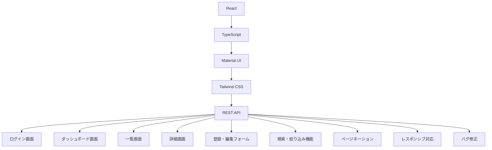

# NEW 初回 管理画面のフロントエンド開発

## 提案概要

本提案では、既存デザインを基にReactを使用して管理画面（ダッシュボード）のフロントエンド開発を行います。具体的にはログイン画面、ダッシュボード画面、一覧画面、詳細画面、登録・編集フォーム、検索・絞り込み機能、ページネーション、レスポンシブ対応、バグ修正を実装します。

## 技術選定と理由

1. **React**: ReactはリアクティブなUI開発に最適で、コンポーネントベースのアーキテクチャにより可視化が容易です。
2. **TypeScript**: TypeScriptはJavaScriptのスーパーセットで静的型付けを提供し、コード品質を向上させます。
3. **Material UI**: Material UIはGoogleのMaterial DesignをReactで実現するためのUIコンポーネントライブラリで、既存デザインに適応しやすいです。
4. **Tailwind CSS**: Tailwind CSSは低レベルのCSSフレームワークで、カスタマイズ性が高いです。
5. **REST APIとの連携**: AxiosやFetch APIを使用してREST APIと通信します。

## アーキテクチャ図

## 開発アプローチ

1. **コンポーネント化**: 画面を小さなコンポーネントに分割し、再利用性と可視化の容易さを高めます。
2. **TypeScript型定義**: 型安全なコードを書くために、各コンポーネントに適切な型定義を行います。
3. **Material UIとTailwind CSSの組み合わせ**: Material UIのスタイルとTailwind CSSのカスタマイズを組み合わせて、既存デザインに忠実なUIを作成します。
4. **REST APIとの連携**: Axiosを使用してAPIリクエストを行い、データの取得や送信を実施します。
5. **テスト**: 単体テストと統合テストを行い、品質を保証します。

## 本提案の強み

1. **過去の実績**: Reactで複数のプロジェクトに携わっており、コンポーネント化や型安全な開発経験があります。
2. **Material UIとTailwind CSSの知識**: Material UIとTailwind CSSを効果的に組み合わせて既存デザインに忠実なUIを作成する能力があります。
3. **REST APIとの連携**: Axiosを使用してREST APIとの通信を行う経験があり、データの取得や送信がスムーズに行えます。